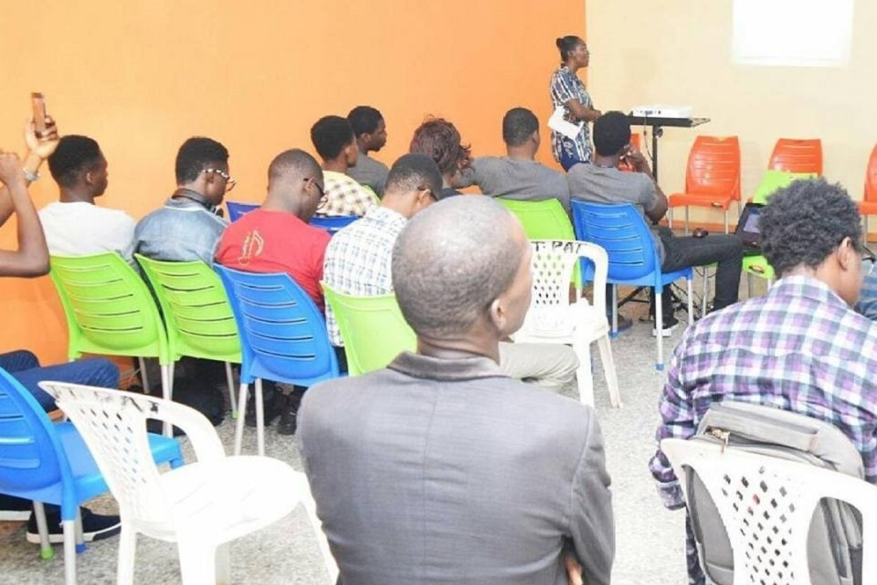
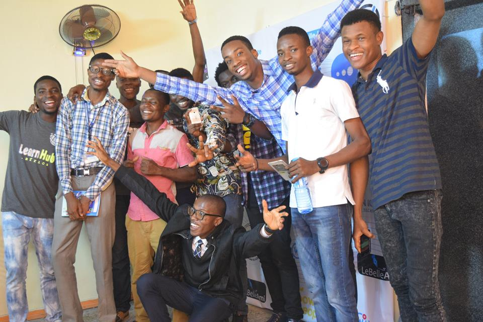
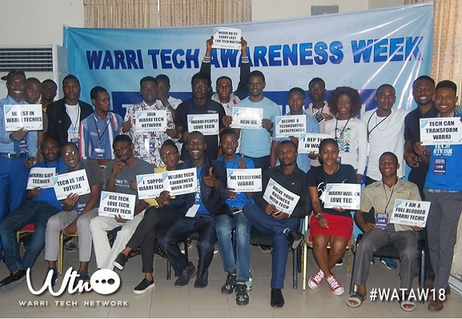
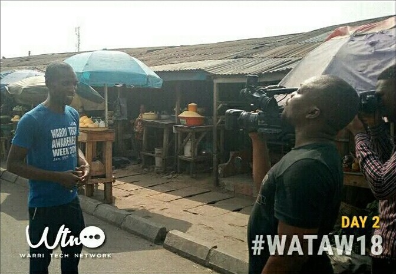
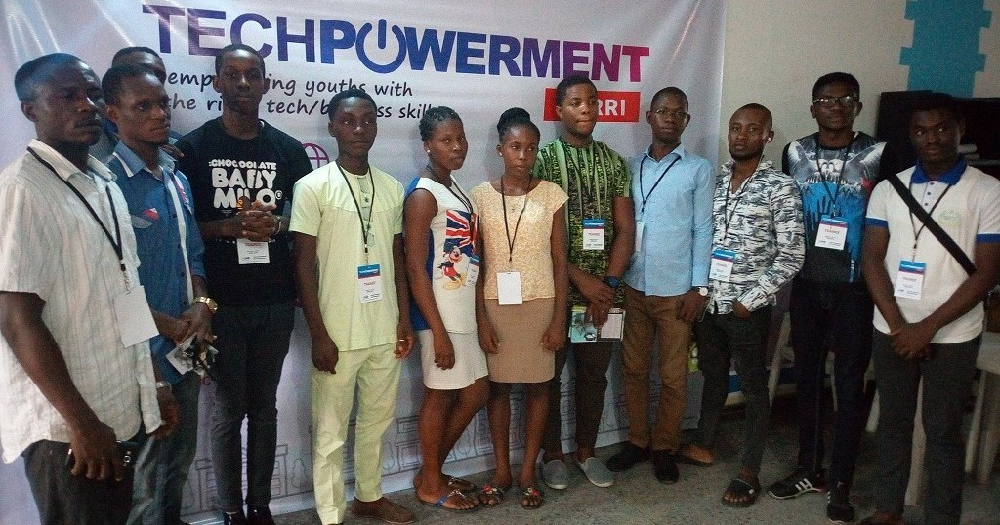
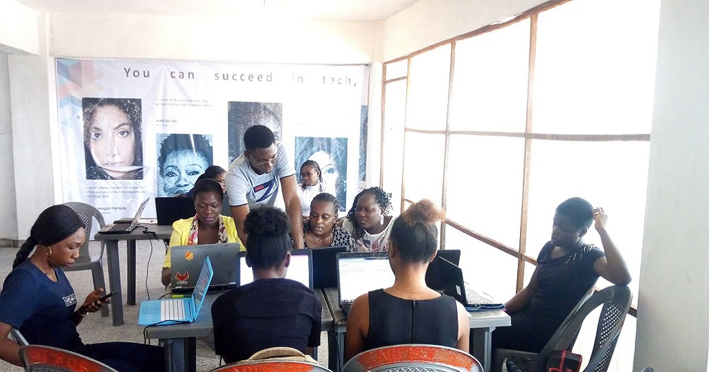
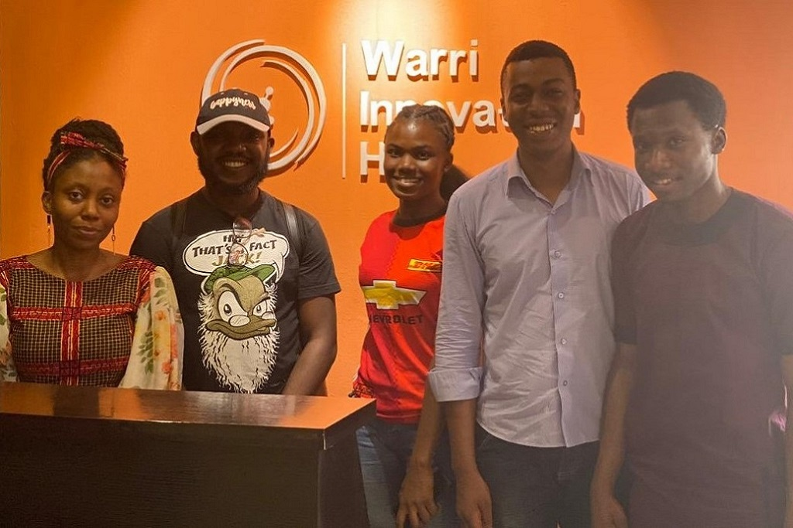
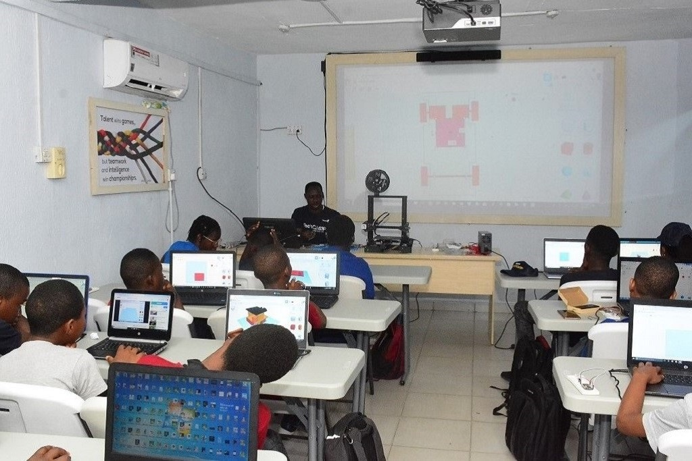
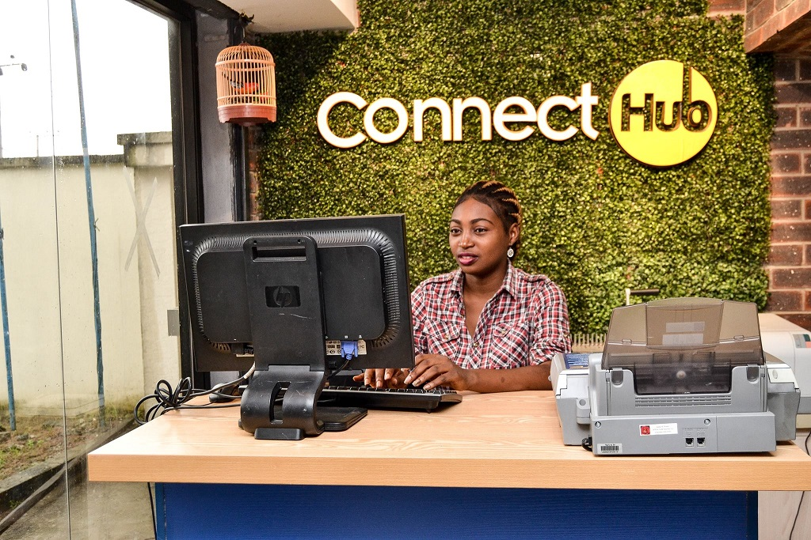

<!--StartFragment-->

*“Then God went down to see the city and the tower that the sons of men had built. God then said: Look! They are one people with one language, and this is what they have started to do. Now there is nothing that they may have in mind to do that will be impossible for them.” - Genesis 11: 5, 6*

“**There is nothing that … will be impossible for them**.” Those were the words of the Almighty when he looked down from heaven to observe what some small group of determined men was trying to do about five thousand years ago. Had the Almighty not stopped those guys, they probably would  have succeeded in building the first skyscraper ever. The lesson from that Bible verse is clear: **\*nothing (except the Almighty) can stop a group of determined individuals who are united in thoughts and actions towards a common goal\****.*

That Scriptural text helped Paul appreciate the power of collaboration and resilience. He became more determined to continue seeking like minded individuals in Warri to collaborate with in building his dream tech ecosystem. Forging ahead, he formed a new social media platform called ‘Warri Startups Development Foundation’ (WAFSDEF) and started using it to propagate his vision online. 

 

One fateful day, while Paul was going through some twitter threads he stumbled into a tweet by New Warri asking Waffirians to share their vision of a new Warri. Paul quickly jumped on the tweet and shared his vision of Tech Warri. Three weeks after, Paul met with Collins Azuike *(the guy behind the New Warri handle)* and shared more info with him. Paul asked Collins to link him up with Igho Tietie *(aka Warri Update)* a prominent social media influencer. Collins did and the next day Paul had a meeting with Igho. Later, Igho introduced Paul to Tobore Adakaraza, a tech enthusiast and pastor shaping bright minds in Warri to pursue excellence and change the narrative on Warri. Pastor Tobore commended Paul for his vision for Tech Warri and gave him some helpful advice. Later he linked him up with Oreva Akakasi *(a designer and startup founder).* Few weeks later at networking gathering for entrepreneurs*(tagged The MIX)*which was put together by Connect Hub, Paul met other great minds in likes Mofe Pira, Anita Okiotor, and Tobore Didaskalos. He shared his vision of Tech Warri with them and they were in. The following day a meeting was scheduled at Chicken Republic Airport Road. Alex Okome and Nancy Ogbonnaya also joined the meeting and at the end of the day a new tech-startup community named ‘Delta Technology Entrepreneurship and Collaboration Hub’ – DTECH was formed. The plan was for DTECH to serve as the corporate entity that will drive the ecosystem's vision to reality. 

Two months later, DTECH organized her first event tagged ‘Warri Tech Hangout’. The event was a huge success as no less than 30 people RSVP’d. Some tech enthusiasts who attended the ‘Warri Tech Hangout’ include Nancy Ogbonayan, Chukwudi Chigbundu, Kelly and Scofield Idehen, Oghenero Israel, Kelly Igbinovia and some staff of Connect Hub. Some Waffirians in the diaspora RSVP’d for the event but was unable to join in via an online video conferencing due to technical issues. One such person was Edirin Atumah.

Like Paul, Edirin also wants to see a thriving tech ecosystem in Warri. As an individual, he’s been using his funds and platforms (Powered-People) to promote tech in Warri. Around October 2017, Edirin visited from the UK. He was planning a hackathon tagged HackWarri. He reached out to Paul as someone who’s been on the ground, to assist in getting developers/designers in Warri to participate in the hackathon. Paul agreed to help and together they both went round town pitching to developers the need to attend and participated in the hackathon. This movement gave Paul an opportunity of meeting other tech enthusiasts in the city; the likes of Monica Yeresha, Kenneth Ijama, Tega Ovie, Uvie Jakpor, Joseph Ijekeye, Frank Waive, and Omawumi Eyekpimi. The hackathon was a success partly due to the collaborative mindsets that everyone adopted*(both organizers and participants).*After the hackathon ended, everyone returned to their normal lives as they were doing before. But Paul kept thinking of how to build on the gains of the just concluded hackathon. For more than a year now, he’s been trying to bring tech enthusiasts in the city together as a united community that supports each other for growth and success, but have not been able. “Here is a great opportunity to attempt again”, he thought to himself. The attempt he did and this time he succeeded. He invited a dozen friends and acquaintances for a meeting at Chicken Republic Airport Road on November 5 2017 but only five persons*(Kelly, Igho, Omawumi, Uvie, and Joseph)*showed up. Paul shared his vision to establish a tech ecosystem in Warri with them and everyone keyed in. Then and there, the Warri Tech Network (WTN) was formed. 

 

The first WTN Tech Meetup was scheduled for November 25 2017 and boom “everywhere burst” as Warri people will say. Themeetup saw over 50 tech enthusiasts in attendance. It was one of the most memorable meetups of all time. Everyone was on fire, hungry to learn and do more to take Tech Warri to the next level. One guy enjoyed the meetup so much he suggested that it should be happening every weekend. The moment Paul has been waiting for had come, so straight away he created a Warri Tech Community WhatsApp Group and added to the group, everyone who is enthusiastic about tech in Warri, shares the group’s vision and agrees to abide by its Community Guidelines. That was how little by little, the Warri tech community grew from a few dozens to hundreds in a few months. It just kept growing both in size and in-depth.

 

The following year (2018) saw the Warri tech community witness exponential growth. Paul and his friends kicked off the New Year with a bang. They figured out that, the biggest obstacle hindering technology growth in the city was*lack of public awareness for tech*. So they organized a one-week tech awareness campaign tagged Warri Tech Awareness Week \[#WATAW18]. The first of its kind. They visited universities and colleges, radio stations, shopping malls, and motor-parks, marketplaces, and crowded streets of Warri, preaching tech adoption to the youths and elderly. Encouraging young people to go learn a tech skill and use it to empower themselves and transform the city instead of waiting for their parents or government to hand opportunities to them. Many youths responded well to the message. A lot of them came forward during and after the campaign, asking for guidance on how to start a career in tech.

 

 

What follows next was a massive tech empowerment campaign in the city. Experience developers in the Warri tech community volunteered and assisted hundreds of youths to learn how to code for free. WTN organized various free coding programs like TechPowerment, WarriGirlsCode, and CampusCode to help youths learn how to code. Meetups were organized regularly to provide hands-on assistance to beginner developers having blockers and to keep the steam going for others. As the months roll by, we started seeing local chapters of another tech/startup communities springing up in the Warri tech ecosystem. The likes of forLoop Africa, Startup Grind, Andela Learning Community, Figma Africa, Google Developers Group, Facebook Developers Cycle, GitlabNG, and many others. All these different communities have contributed one way or the other to the growth, diversity, and depth we see in Warri burgeoning tech ecosystem today. The ecosystem has grown from a few dozen tech enthusiasts some years ago to over ten thousand tech enthusiasts today.

 

But there is more to the ecosystem than just a growing number of tech enthusiasts. There are now six technology hubs in the city, Waffii Hub, Skysenx Hub, Learn Hub Africa amongst others. The ecosystem also has lots of awesome tech startups with high-growth potentials. The likes of LessStress, Linkorion, Nemo, Perfect-Ikon, Brainstack, Softcodes, Water-Powered-Generator, BookAMechanic, XchangeWaste, DataDepot, Unicus, Da-Manager, Fujo.io, and many others. There are also some great law-firms and accounting-firms in the ecosystem providing startups with needed legal, financial services. Amalgam Legal and Juricity are among the top startup-centric law firms around. An angel investor’s network (DAIN) will soon launch operations in the region. Plus the three tertiary institutions (Fupre, PTI, and COEWA) that are in the city are now more supportive and open to partnership opportunities between them and local tech communities. If things continue at this rate, the Warri tech ecosystem in the no-distant future will become a force to reckon with in the global tech space.

But all this didn’t happen by chance. The growth we see today in the Warri tech ecosystem is a product of self-sacrifice, hard work, collaboration, and consistency. Some few individuals made huge selfless sacrifices to get the ecosystem off the ground and scale, some two-three years ago. They freely expended their time, energy, money, and influence to support the ecosystem’s growth. The final part of this article (Part II) is dedicated to the unsung heroes, supporters, and contributors who all helped brought the Warri tech ecosystem this far. Stay with me.

<!--EndFragment-->